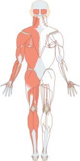

# Muscle Back SVG Overlays

This directory contains separate SVG overlay files for each major muscle group that can be overlayed on the `Muscles_back.svg` base image.

## Overview

These SVG files are designed to work with the muscle soreness visualizer in the TrackLifts app. Each file represents a specific muscle group and can be dynamically colored to represent different soreness levels.

## Files

### Base Image
- **Muscles_back.svg** - The base anatomical image of the back view of the human body
  - ViewBox: `0 0 165 331`
  - Dimensions: 165mm × 331mm

### Overlay Files

#### 1. muscles_back_back.svg
- **Muscle Groups:** Latissimus dorsi, trapezius, erector spinae
- **Region:** Upper and mid back
- **Coverage:** Central back area from shoulders to lower back

#### 2. muscles_back_shoulders.svg
- **Muscle Groups:** Posterior deltoids
- **Region:** Upper shoulders
- **Coverage:** Both left and right shoulder caps

#### 3. muscles_back_arms.svg
- **Muscle Groups:** Biceps, triceps
- **Region:** Upper arms (both left and right)
- **Coverage:** Full length of both arms from shoulders to elbows

#### 4. muscles_back_legs.svg
- **Muscle Groups:** Hamstrings, glutes, calves
- **Region:** Lower body (both left and right)
- **Coverage:** Full length of both legs from glutes to calves

## Technical Specifications

All overlay files:
- Share the same viewBox (`0 0 165 331`) as the base image for perfect alignment
- Use SVG path elements with stroke and fill properties
- Are optimized for performance with simplified path data
- Support dynamic color changes via CSS or inline styles

## Usage

These SVG overlays can be used in multiple ways:

### 1. Direct Overlay in HTML
```html
<div style="position: relative;">
  
  
</div>
```

### 2. In React Native (with react-native-svg)
```jsx
import { Svg, Path } from 'react-native-svg';

<Svg viewBox="0 0 165 331">
  {/* Base body outline */}
  <Path d="..." fill="#f8f8f8" stroke="#ccc" />
  
  {/* Overlay muscle group with dynamic color */}
  <Path 
    d="M 50 65 C 60 55 70 52 82.5 52..." 
    fill={getSorenessColor(backSoreness)}
    stroke="#555"
  />
</Svg>
```

### 3. CSS Styling
```css
.muscle-overlay path {
  stroke: #ff0000;
  stroke-width: 2.5;
  fill: rgba(255, 87, 87, 0.4);
  opacity: 0.85;
}
```

## Customization

To modify the appearance for different soreness levels:
- Change the `fill` color to represent intensity (e.g., green → yellow → red)
- Adjust `opacity` for subtle or prominent highlighting
- Modify `stroke-width` for thicker/thinner outlines
- Use CSS classes or inline styles for dynamic updates

## Coordinate System

The viewBox coordinate system:
- **Origin (0,0):** Top-left corner
- **Width:** 165 units (horizontal)
- **Height:** 331 units (vertical)
- **Center X:** 82.5
- **Body regions:**
  - Head: Y 10-40
  - Shoulders: Y 45-65
  - Back/Arms: Y 65-190
  - Legs: Y 190-320

## Contributing

When creating new overlay files or modifying existing ones:
1. Maintain the same viewBox dimensions
2. Use simple, clean path data
3. Test alignment with the base image
4. Document muscle groups covered
5. Ensure paths don't overlap inappropriately with other muscle groups

## License

These files are part of the TrackLifts project and follow the same license as the main repository.
